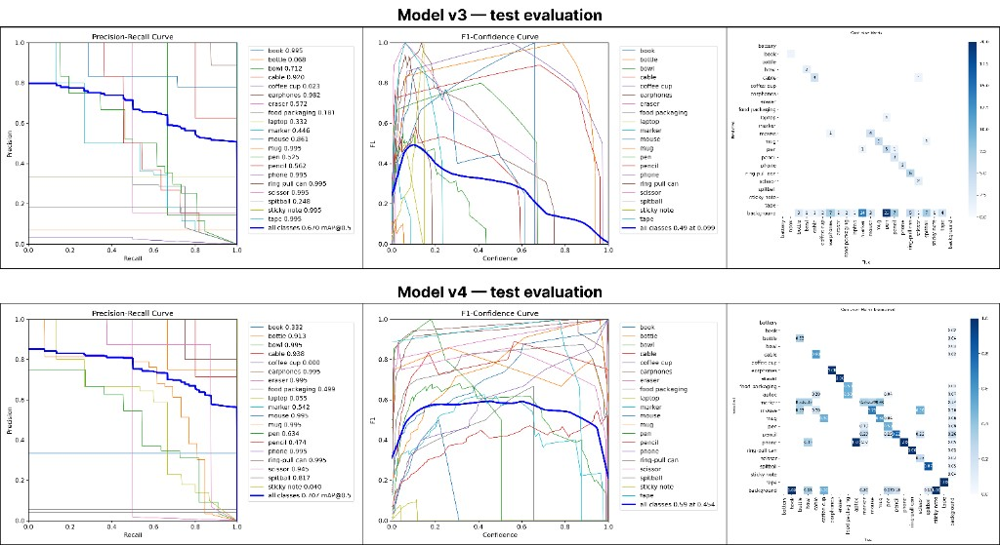
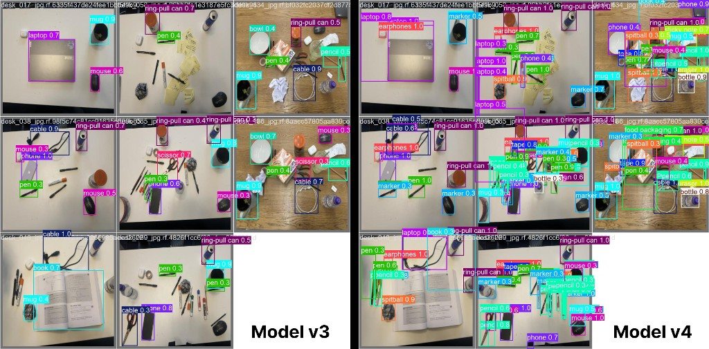
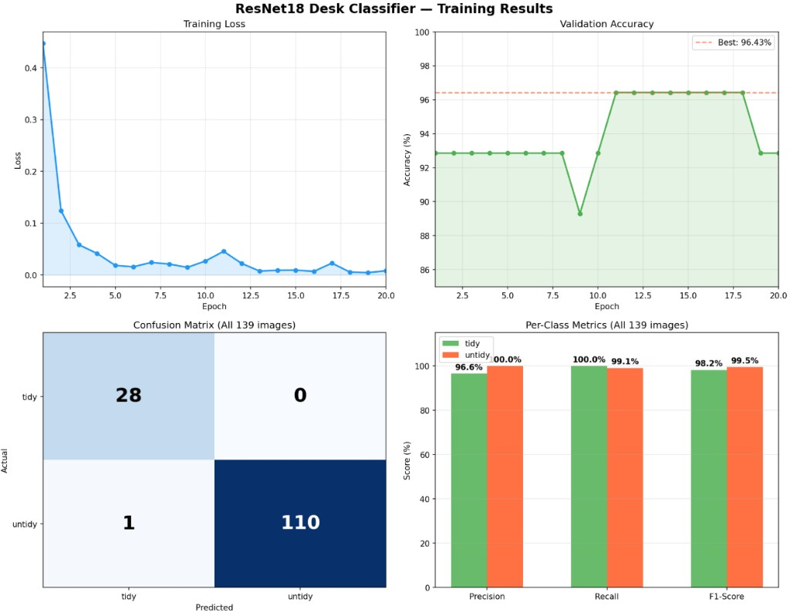
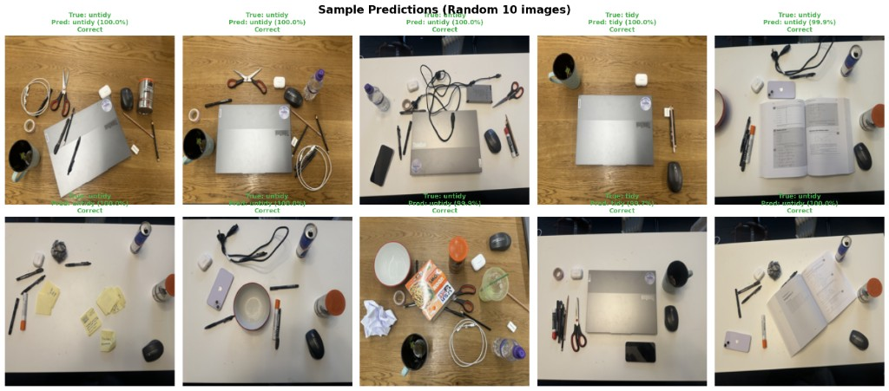
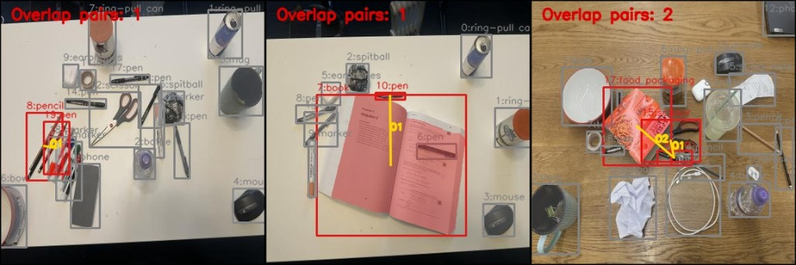
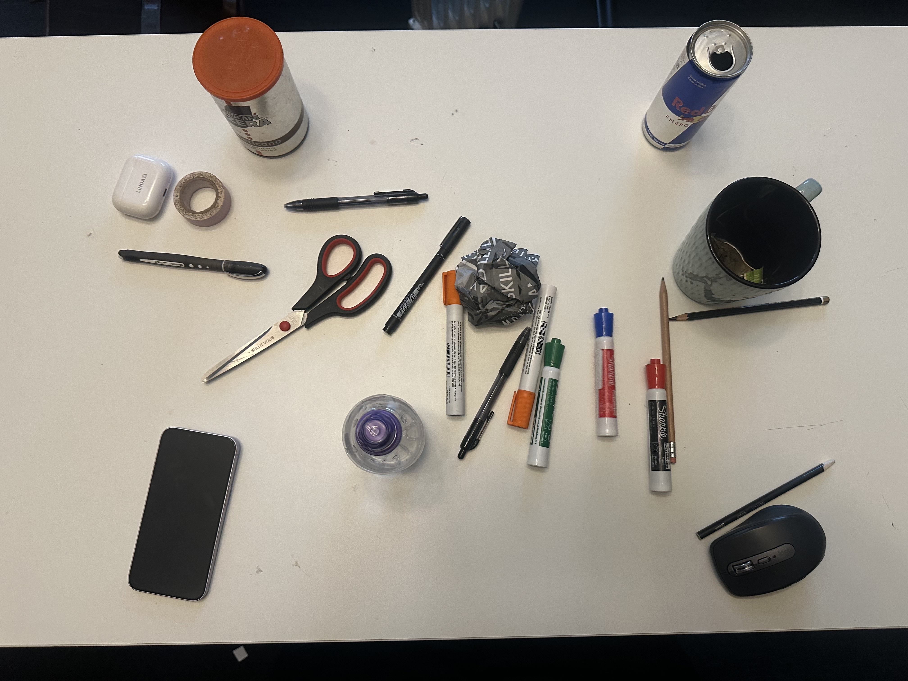
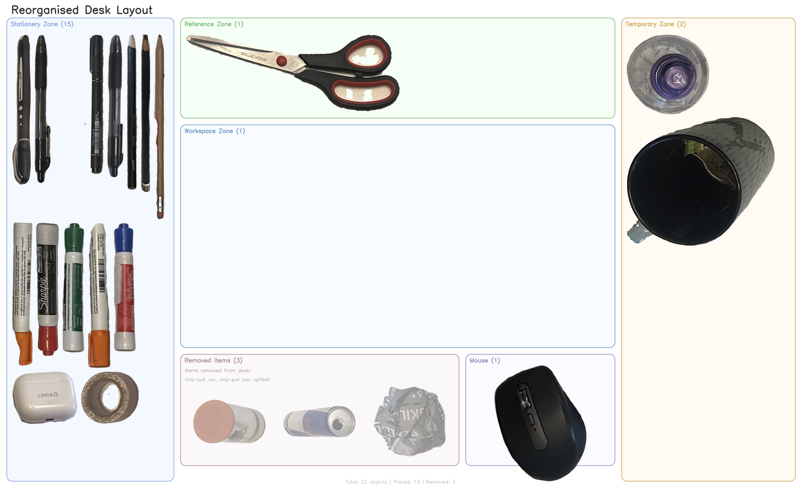
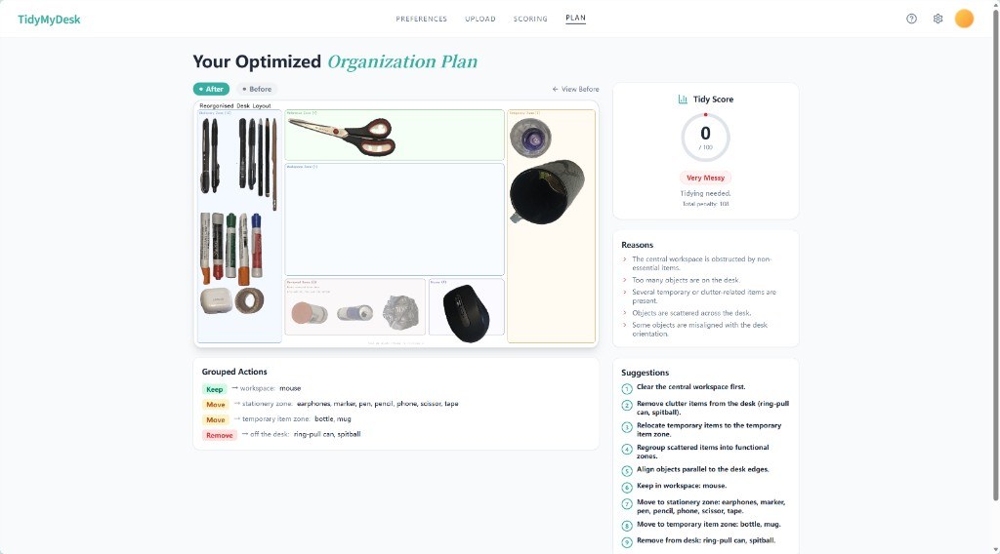

# ComputerVision-DeskTidier

Desktop organization project using computer vision.

## Description

We built a vision-based desktop tidiness decision system that combines object detection, scoring, and actionable cleanup guidance. In this repository, we implemented an end-to-end pipeline with a YOLO-based desk object detector, a rule-based tidy scoring framework (object load, category mix, central workspace obstruction, overlap, and alignment), batch CSV export for evaluation, and recommendation modules that translate detections into clear, grouped cleanup actions.


## What We Achieved

Beyond the GitHub codebase, we also developed a demo web page to showcase real user interaction: users first choose their dominant hand (left or right), then upload a desk photo, after which the system detects desk objects, decides whether tidying is needed and how messy the desk is (with a scoring table), and finally generates both visual and text-based organizing plans (image + language guidance). Together, these components form a practical decision-support tool for personalized desk organization.


## Demo

**Web app:** [https://tidymydesk.com/](https://tidymydesk.com/) Walk through detection, scoring, and tidy suggestions in the browser.


## Quick test (demo)

Run from the **repository root** (requires trained weights at `runs/detect/desk_tidy_runs/v4_yolov8m_roboflow_style/weights/best.pt`):

```bash
python scripts/teacher_demo.py data/images/desk_066.jpg
```

**You get:** `teacher_demo/*_detection.png` (YOLO boxes), terminal **tidy level + score + penalty breakdown + text tidy plan**, and `teacher_demo/*_before_after.png` (original vs suggested layout). Use any image path instead of `data/images/desk_065.jpg` if needed. Add `--left-handed` for a left-handed layout.

### Output Example：

#### Image: desk_066.jpg

#### Classifier: skipped

#### Detected 22 objects:

   phone              conf=0.99  [Study Items], angle=-90.0°
   ring-pull can      conf=0.98  [Clutter Items]
   ring-pull can      conf=0.97  [Clutter Items]
   marker             conf=0.97  [Study Items], angle=89.5°
   pencil             conf=0.97  [Study Items], angle=-29.0°
   scissor            conf=0.96  [Temporary Items]
   bottle             conf=0.96  [Temporary Items]
   pen                conf=0.96  [Study Items], angle=6.3°
   pen                conf=0.95  [Study Items], angle=-73.5°
   spitball           conf=0.95  [Clutter Items]
   mouse              conf=0.94  [Core Work Items]
   marker             conf=0.94  [Study Items], angle=87.1°
   pen                conf=0.93  [Study Items], angle=-55.5°
   marker             conf=0.93  [Study Items], angle=-82.4°
   pen                conf=0.92  [Study Items], angle=-4.6°
   marker             conf=0.91  [Study Items], angle=-80.4°
   marker             conf=0.90  [Study Items], angle=88.6°
   earphones          conf=0.89  [Study Items], angle=-67.2°
   pencil             conf=0.88  [Study Items], angle=-5.8°
   mug                conf=0.87  [Temporary Items]
   tape               conf=0.83  [Temporary Items]
   pencil             conf=0.75  [Study Items], angle=88.8°

#### Tidy Score: 0 (Very Messy)

#### Total Penalty: 108

#### Penalty breakdown (by type):

   · alignment_penalty: 55
   · category_penalty: 20
   · object_load_penalty: 10
   · spatial_dispersion_penalty: 5
   · spatial_overlap_penalty: 0
  workspace_obstruction_penalty: 18
  22 objects detected -> object load penalty 10
  Category counts: Clutter=3, Core=1, Study=14, Temporary=4; category penalty 20
  15 objects in central workspace; blocked categories=3 -> workspace penalty 18
  Overlap pairs (IoU>0.30): 0 -> overlap penalty 0
  Dispersion: Medium -> dispersion penalty 5
  Misaligned objects: 11 -> alignment penalty 55

#### Decision: Tidying needed.

#### Reasons:

   · The central workspace is obstructed by non-essential items.
   · Too many objects are on the desk.
   · Several temporary or clutter-related items are present.
   · Objects are scattered across the desk.
   · Some objects are misaligned with the desk orientation.

#### Suggestions:

   · Clear the central workspace first.
   · Relocate temporary items to the temporary item zone.
   · Regroup scattered items into functional zones.
   · Align objects parallel to the desk edges.
   · Keep in workspace: mouse.
   · Move to stationery zone: earphones, marker, pen, pencil, phone, scissor, tape.
   · Move to temporary item zone: bottle, mug.
   · Remove from desk: ring-pull can, spitball.
Plan image saved: C:\Users\Documents\GitHub\ComputerVision\teacher_demo\desk_066_plan.png
After image saved: C:\Users\Documents\GitHub\ComputerVision\teacher_demo\desk_066_after.png


## Evidence

The system aims to quantify desk tidiness by combining object detection with rule-based reasoning. It is implemented as a linear pipeline with optional branches, and each stage produces intermediate outputs (e.g., detection overlays, score CSVs, and relayout images) that can be inspected independently.

The overall workflow follows:
Dataset → Train YOLO → Infer → TidyScore → Language → Visual outputs

The modules were implemented incrementally. Detection results were first validated independently before being passed into the scoring module, and scoring outputs were checked in isolation before enabling language and visual generation.

### Detection and post-processing

We used a YOLO-format desk dataset imported from Roboflow-style exports, with train/validation splits and class names aligned to desk-relevant objects such as laptops, books, pens, mugs, and cables. These raw labels are later mapped in software to higher-level semantic categories used for interpretation.

We trained a **YOLOv8m** detector, with the best weights stored under `runs/detect/desk_tidy_runs/v4_yolov8m_roboflow_style/weights/best.pt`. On the validation split at the end of training, using the final epoch recorded in `results.csv`, the detector achieved approximately the following box metrics:

| Metric (val, last epoch) | Value  |
|--------------------------|--------|
| Precision (B)            | ~0.783 |
| Recall (B)               | ~0.816 |
| mAP@0.5                  | ~0.851 |
| mAP@0.5:0.95             | ~0.803 |

These values reflect detection reliability rather than tidiness itself, but indicate that the detector is sufficiently accurate to support downstream reasoning.



*Figure 1 — Detection and post-processing comparison between **Model v3** and **Model v4** on test evaluation outputs (PR curve, F1-confidence curve, and normalized confusion matrix).*

Before using detections for scoring, we tuned post-processing parameters to obtain stable object counts. Default thresholds often resulted in either missed objects or duplicate detections.

We converged toward settings such as confidence ≈ 0.4, NMS IoU ≈ 0.5, and inference size 640. Lower confidence thresholds introduced duplicate boxes, while higher thresholds missed small objects such as pens and cables. These parameters were selected by comparing detected counts and class distributions against manually inspected images.



*Figure 2 — Qualitative detection comparison on held-out desk images: **Model v4** recovers more small and cluttered objects (e.g. pens, markers, cables) than **Model v3** on the same inputs, illustrating the impact of detector iteration before downstream tidy scoring.*

### Classifier

We developed a binary image classifier to determine whether a desk is tidy or untidy, which serves as the first decision stage of our system. The goal is to quickly identify whether tidying is needed before applying more detailed scoring and suggestion modules. We used a fine tuned ResNet18 model with transfer learning, trained on a dataset that we collected ourselves due to the lack of suitable existing datasets. The model learns global visual features such as object density, clutter distribution, and workspace obstruction to make the classification.

The classifier achieved strong performance, correctly classifying 138 out of 139 images. As shown in **Figure 3**, the model converges quickly with low training loss and stable validation accuracy, and performs well across both classes according to the confusion matrix and per-class metrics. **Figure 4** presents sample predictions on random desk images, demonstrating that the classifier generalises well across different desk layouts and clutter conditions.



*Figure 3 — ResNet18 desk classifier training results: loss and validation accuracy over epochs, confusion matrix on all 139 held-out images, and per-class precision/recall/F1.*



*Figure 4 — Sample predictions on random desk images (ground truth vs predicted label and confidence).*

### Tidy Scoring

The tidy score is computed as an aggregation of penalties reflecting object quantity, semantic importance, spatial organisation, and alignment. Each component was implemented as an independent rule and iteratively refined based on observed failure cases.

**Object load** penalises the total number of detected objects using stepped brackets, with higher counts leading to higher penalties up to a capped value.

**Category penalty** assigns each object to a semantic category (core, study, temporary, clutter), with different weights reflecting their perceived contribution to messiness.

**Workspace obstruction** uses a central rectangle covering 60% of the image area. Objects whose bounding box centres fall inside this region are considered to obstruct the workspace. This mechanism was refined from per-object penalties to per-category accumulation, to avoid over-penalising repeated instances of the same object type.

**Spatial disorder** includes dispersion and overlap. Dispersion measures how widely objects are spread across the desk. Overlap was initially based on bounding-box IoU and containment, but this failed in cases where objects appeared visually overlapping without sufficient box intersection. To address this, we introduced mask-assisted overlap and additional heuristics for elongated objects such as pens on books, using overlap ratios and principal-axis coverage. This also reduced false positives for adjacent similar objects such as two pens placed side by side.



*Figure 5 — **Spatial disorder (overlap):** examples of detected **overlap pairs** used to compute the overlap penalty (red pairs / yellow connectors; grey boxes are non-overlap detections). Pair counts vary by scene (e.g. pen–pencil, pen-on-book, packaging with adjacent items).*

**Alignment** penalises orientation deviation from the assumed desk direction (0°). Rectangular objects use OpenCV `minAreaRect`, while elongated objects use `HoughLinesP`. This component was introduced after observing that some desks appeared visually untidy despite low penalties in other dimensions.

Several refinements were directly driven by failure cases. For example, cases where multiple apparent overlaps still produced zero IoU-based penalty led to the introduction of mask-based overlap. Cases involving adjacent pens or pen-on-book configurations led to more specific interaction rules for elongated objects. Workspace scoring was also adjusted after early versions produced overly harsh or overly lenient results depending on region definition. Each change was validated again on a small set of test images.

### Tidy up suggestions

Our suggestion model is a **rule-based recommendation module** built on top of the object detection and tidy scoring pipeline.

First, the system takes the detected desk objects and the tidy score result as input. Then it maps each detected object to a predefined action and target zone, such as **keep**, **move**, **route**, or **remove**. For example, laptops and mice are kept in the workspace, stationery items such as pens are moved to the stationery zone, cups and bottles are moved to a temporary item zone, and clutter items like packaging or trash are removed from the desk.

After that, the model combines two levels of reasoning. At the **global** level, it reads the penalties from the tidy scoring system, such as workspace obstruction, too many objects, overlap, dispersion, and misalignment, and converts them into high-level explanations like “the workspace is obstructed” or “objects are scattered.” Then it generates strategic suggestions such as clearing the central workspace first, regrouping items into functional zones, or aligning objects with the desk edges. At the **object** level, it groups detected items by action and destination, so instead of producing many repetitive sentences, it outputs compact recommendations such as “Move to stationery zone: pen, pencil, marker.” This makes the output more structured, interpretable, and easy for users to follow.

The visual relayout module (SAM-based cutouts placed into labelled zones) turns the same logic into an **“after” desk diagram**. Below, **desk_066** compares the **original photograph** with the **reorganised layout** suggestion.

| Original photograph (`data/images/desk_066.jpg`) | Reorganised layout suggestion (`outputs/relayout_examples/desk_066_relayout.png`) |
| :-----------------------------------------------: | :---------------------------------------------------------------------------------: |
|  |  |

*Figure 6 — Example **desk_066**: messy desk photo (left) vs rule-based zone relayout with grouped actions (right).*

### Web demo (TidyMyDesk)

The public demo at **[tidymydesk.com](https://tidymydesk.com/)** wraps the same pipeline in a browser UI: preferences (e.g. handedness), upload, scoring, and a **Plan** view with reorganised zone layout, grouped actions (keep / move / remove), tidy score, reasons, and suggestions.



*Figure 7 — **Web demo (TidyMyDesk):** PLAN screen showing zone-based “after” layout, grouped recommendations, and score + reasons + suggestions (example: desk_066-style result).*

### Deliverables checklist

| Item                           | Location / note                                                                                                   |
| ------------------------------ | ----------------------------------------------------------------------------------------------------------------- |
| Scoring specification          | `scoring_module/docs/Scoring Framework.md`                                                                        |
| Main pipeline                  | `scripts/run_pipeline.py`                                                                                         |
| One-command demo               | `README.md` → `python scripts/teacher_demo.py …`                                                                  |
| Trained detector weights       | `runs/detect/desk_tidy_runs/v4_yolov8m_roboflow_style/weights/best.pt` *(may be gitignored; provide if required)* |
| Example CSV / language exports | e.g. `scoring_module/outputs/`, `language_score_results.md`                                                       |
| Evidence narrative             | `README.md` → `## Evidence` section                                                                               |


## Evaluation

The application is designed as a vision-based desk tidiness assistant that generates a structured evaluation from a single image. It uses a custom-trained YOLO detector to identify common desk objects and applies a transparent rule-based scoring model to convert detections into a 0–100 tidiness score, a qualitative label, and actionable suggestions. In addition, a lightweight binary classifier is used to determine whether the scene is already tidy, allowing the system to skip deeper analysis when appropriate. This end-to-end pipeline—detection, scoring, explanation, and recommendation—makes the system function as a simple decision-support tool rather than just a detector.

A key strength of the system is that it operationalises the abstract concept of “clutter” in a structured way. The score combines several dimensions, including object count, semantic categories (core items vs. temporary items), spatial risk (whether objects occupy the central work area), geometric clutter (overlap and dispersion), and approximate alignment of elongated objects. The system also produces rich and interpretable outputs, such as annotated detection images, penalty breakdowns explaining score reductions, grouped action suggestions, and visualised “after” layouts. These outputs help users understand why a score is assigned and how to improve their workspace.

However, the system has several limitations. First, its performance depends heavily on the accuracy of the object detector. Missed detections or incorrect labels can directly affect the score. Second, the scoring system is based on predefined rules, which reflect design assumptions and may not generalise across different cultures, desk sizes, or personal work styles. Third, object overlap and segmentation are only approximated, making it difficult to handle cases such as transparent objects, heavy occlusion, or unseen categories. Fourth, orientation estimation is relatively coarse and may be unreliable for irregular shapes or complex backgrounds. Fifth, the generated layouts are only illustrative suggestions and do not consider physical constraints such as gravity, cable length, ergonomics, or user habits. Finally, the binary “tidy vs. cluttered” judgement is based on a simple classifier and should not be interpreted as an objective measure of productivity or organisation.

Overall, this system is best understood as an interpretable prototype rather than a complete solution. It demonstrates how visual detection can be combined with rule-based reasoning to provide structured feedback and actionable suggestions. At the same time, it highlights the trade-offs involved in automating subjective concepts such as tidiness, and the continued importance of human judgement in understanding context and personal needs.


## Personal Statement -- Yiwen Cao

I collaborated with Linda to develop the initial concept of this project. She was designing a robot called MicroTidy, and we positioned our system as its “eyes and brain”, responsible for perception and decision-making. 

As my first attempt at building a computer vision pipeline from scratch, I chose to construct the dataset myself rather than rely on existing ones, as they did not fully match our context. We collected around 150 desk images and jointly annotated them, with me defining 20 object categories and annotating 26 images. I then trained a YOLOv8 model to detect common desk objects such as pens, books, cups, and cables. After four rounds of iteration, the model achieved Precision 0.783, Recall 0.816, and [mAP@0.5](mailto:mAP@0.5) of 0.851.

After the detection stage, I developed the Tidy Score module, which evaluated desk organisation across Object Load, Category, Workspace Obstruction, Spatial Disorder, and Alignment. During this process, I realised that some aspects of tidiness are difficult to capture through rule-based methods alone. In particular, Spatial Disorder and Alignment were the most challenging. For overlap detection in Spatial Disorder, I refined the method from basic bounding box IoU and containment rules to a mask-assisted approach, which reduced cases where large bounding boxes were mistaken for real overlap. I also introduced additional rules for elongated objects on flat surfaces, such as pens placed on books, using axis coverage and area proportion to reduce false positives and improve detection accuracy. For Alignment, I used different visual methods for different object categories: rectangular objects such as laptops, books, notebooks, phones, and sticky notes were analysed using OpenCV’s minAreaRect, while elongated objects such as pens, pencils, markers, and scissors were analysed using HoughLinesP. Irregular objects such as mugs and cables were excluded from angle estimation. Even with these refinements, I believe both modules still have room for improvement.

One important limitation I identified was that some implicit human judgements of tidiness, such as subtle visual alignment between a cup and the edge of a laptop, are difficult to detect reliably with hand-crafted rules and may be better addressed through machine learning. To improve the overall system, we adopted a modular two-stage strategy: a binary classifier developed by Linda first determines whether the desk needs tidying, and only if tidying is needed does the system proceed to detailed scoring. This made the system more robust and interpretable. 

I also worked on the text-based recommendation component, producing concise and practical tidying suggestions, and collaborated with Linda on a simple demo website, where I built the overall framework and she focused on visual refinement and interface details.

Through this project, I not only developed technical skills in computer vision and system building, but also gained a stronger understanding of how to design an interpretable and extensible system. One key lesson was that modularising detection, classification, scoring, and recommendation made the system easier to explain, test, and improve. At the same time, the project showed me the limitations of purely rule-based approaches in capturing human perceptions of order. 

The current system still has limitations, including relatively simple layout rules that only consider left- and right-handed preferences in a basic way, and the lack of safety-aware logic, such as detecting risky placements like a cup positioned too close to a laptop. If given more time, I would like to develop a more personalised strategy system and explore the use of large language models to generate more natural, context-sensitive recommendations.


## Personal Statement - Linda

I worked closely with Yiwen to design the initial idea about the project. As I'm thinking design a MicroTidy robot, we decided to position this system as the “eyes and brain” of the robot, responsible for perception and decision making.

This project was my first time building a computer vision pipeline from zero. One of the first challenges we faced was the lack of a suitable dataset. We collected our own desk data by photographing and constructed a dataset of around 150 images. Initially, I experimented with pretrained ImageNet models and COCO-based YOLO detection, but the performance was poor because those models were not tailored to desk-level object understanding. To address this, we worked on dataset annotation and I labeled 27 images myself, defining 20 object categories. This step was important because it allowed the model to learn meaningful desk-related semantics rather than generic object classes. After training, the detection performance improved significantly from 4% to 93%.

I then focused on building a binary classifier to determine whether a desk requires tidying. The classifier achieved very high accuracy, correctly classifying 138 out of 139 images. The only misclassified case was also ambiguous even for human judgement, which suggests that the model has learned a reasonable decision boundary. In our system, if the classifier outputs “tidy”, no further action is taken. If it outputs “untidy”, the image is passed to Yiwen’s scoring model for detailed analysis.

After that, I developed the tidy suggestion system. This includes both textual and visual outputs. The textual suggestions are generated based on interpretable factors such as object count, spatial distribution, overlap, and alignment. The visual output reconstructs a reorganised desk layout by grouping objects into functional zones, providing an intuitive “after” view. This combination allows the system to be both explainable and user-friendly. We also built a website to show our demo.

Through this project, I learned not only technical skills but also how to design a system. One key insight is that real-world data is messy and often incomplete. For example, objects may be partially occluded or located at the edge of the image, which makes perfect segmentation impossible. This forced me to think beyond ideal pipelines and design fallback strategies, such as simplifying the visual output when object extraction is unreliable.

In terms of design decisions, we chose a modular pipeline consisting of detection, classification, scoring, and suggestion generation. This makes the system interpretable and easy to extend. We also deliberately separated binary decision making from fine-grained scoring, which improved robustness and clarity.

There are also several limitations in our current system. Due to time constraints, our layout rules are relatively simple and only consider left- and right-handed preferences in a basic way. With more time, I would like to make the system more personalised by allowing users to define their own desk zones and preferences. I would also integrate a large language model to generate more natural and context-aware suggestions.

Additionally, the visual reconstruction could be improved. Currently, some small or thin objects such as pens are difficult to segment cleanly, especially when partially occluded. In future work, I would improve this by using more advanced segmentation models or by designing a hybrid representation that combines icons and extracted object patches.